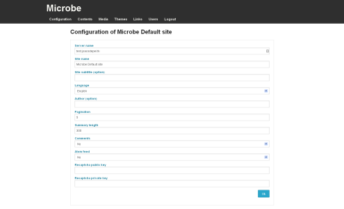

Configuration management
========================

.. note::
   You need to be logged in to the Microbe administration part to manage users, for more information see :doc:`/administrate`.

Configuration can be accessed using the link ``Configuration`` in the administration navigation bar or following this link : ``www.yourwebsite.com/<sub-url/>admin/config``.

You can edit your blog configuration using this page, it will be reloaded as soon as you click the save button.

+------------------------------+------------------------------------------------+
| Name                         | Description                                    |
+==============================+================================================+
| *Site name*                  | Site name                                      |
+------------------------------+------------------------------------------------+
| *Site subtitle*              | Site description                               |
+------------------------------+------------------------------------------------+
| *Language*                   | Interface language                             |
+------------------------------+------------------------------------------------+
| *Pagination*                 | Number of entries per page                     |
+------------------------------+------------------------------------------------+
| *Summary length*             | Number of letters in content summary           |
+------------------------------+------------------------------------------------+
| *Comments*                   | Enable or disable comments on posts            |
+------------------------------+------------------------------------------------+
| *Atom feeds*                 | Generate atom feeds or not                     |
+------------------------------+------------------------------------------------+
| *Recaptcha public key*       | Recaptcha public key to avoid spam on comments |
+------------------------------+------------------------------------------------+
| *Recaptcha private key*      | Recaptcha private key                          |
+------------------------------+------------------------------------------------+
                                 
