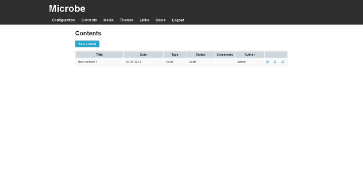
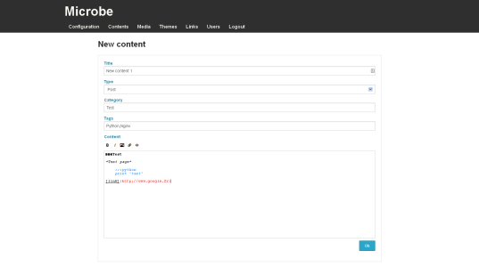
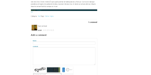

Contents management
===================

.. note::
   You need to be logged in to the Microbe administration part to manage users, for more information see :doc:`/administrate`.

Contents
--------

Contents management can be accessed using the link ``Contents`` in the administration navigation bar or following this link : ``www.yourwebsite.com/<sub-url/>admin/contents``.

This page lists all the contents saved in the application

You can create/delete/edit/publish contents and from this interface using the icons placed at the right column.

+------------------------------+-----------------------------------------------+
| Name                         | Description                                   |
+==============================+===============================================+
| *Title*                      | Content title                                 |
+------------------------------+-----------------------------------------------+
| *Category*                   | Content category (unique)                     |
+------------------------------+-----------------------------------------------+
| *Tags*                       | Content tags separated by commas              |
+------------------------------+-----------------------------------------------+
| *Content*                    | Content using Markdown format                 |
+------------------------------+-----------------------------------------------+

Once content has been created or modified, you need to publish it using the icon placed at the right column to make it available on your site.

Comments
--------

You can enable comments on posts using the :doc:`/config`.

To protect your post, Microbe uses ReCaptcha keys to avoid spam (see :doc:`/faq` for more info).

Once you have enabled it, people will be able to add comment using form from your pages.

Avatar for comments are automatically generated from its author using `VizHash.js`_.

It is possible then to moderate comments using the link present in ``Content management``.

Syntax
------

Microbe supports `Markdown`_ syntax with several extensions.

**Table extension**

You can easily create HTML tables with this extension using the sytax established in `PHP Markdown extra`_.

Thus, the following text

.. code-block:: markdown

   My first header | My second header
   --------------- | ----------------
   Cell 1          | Cell 2
   Cell 3          | Cell 4

will be rendered as

+----------------+-----------------+
|My first header | My second header|
+================+=================+
|Cell 1          | Cell 2          |
+----------------+-----------------+
|Cell 3          | Cell 4          |
+----------------+-----------------+

**Codehilite extension**

The CodeHilite extension follows the same syntax as regular Markdown code blocks, with one exception. The hiliter needs to know what language to use for the code block.

It will use `Pygments`_ to highlight syntax.

If the first line begins with three or more colons, the text following the colons identifies the language. The first line is removed from the code block before processing and line numbers are not used

.. code-block:: markdown

   :::python
   def main(*args) :
       """
       Main function
       """
       if 'i' in 'this is a test' :
           print 'test'

will be rendered as::

  def main(*args) :
      """
      Main function
      """
      if 'i' in 'this is a test' :
          print 'test'

**Content alignment**

The Markdown syntax does not come with a functionnality to easily align your contents.

FliKISS comes with `Mou`_ syntax to center or right align your contents.

.. code-block:: markdown

   -> A center content <-
   -> A right align content ->

will be rendered as

.. code-block:: html

   
 A center content 

   
 A right align content 

**Drad and drop**

Microbe editor supports HTML5 drag and drop API. If your browser supports it you can drop pictures directly in your editor to upload it.

You can also drop plain text files to fill your editor with its content.

.. _PHP Markdown extra: http://www.michelf.com/projects/php-markdown/extra/#table
.. _Pygments: http://pygments.org
.. _Mou: http://25.io/mou/
.. _VizHash.js: https://github.com/sametmax/VizHash.js
.. _Markdown : http://daringfireball.net/projects/markdown/syntax
