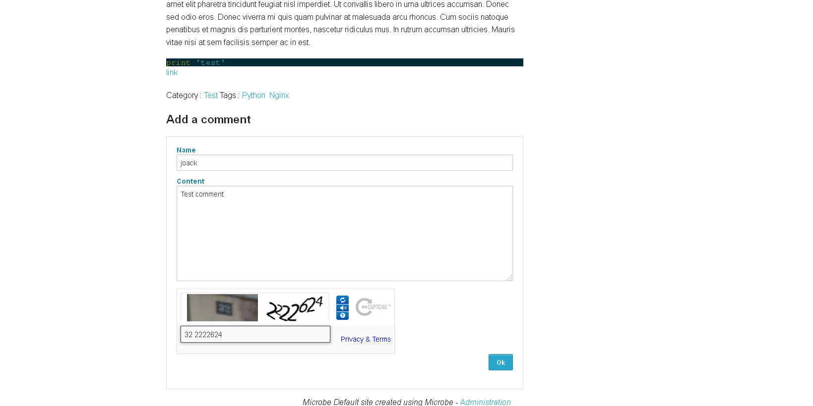

Contents management
###################

.. note:: You need to be logged in to the Microbe administration part to manage contents, for more information see Administration_ part

Contents
========

Contents management can be accessed using the link ``Contents`` in the administration navigation bar or following this link : ``www.yourwebsite.com/<sub-url/>admin/contents``.

This page lists all the contents saved in the application

You can create/delete/edit/publish contents and from this interface using the icons placed at the right column.

+------------------------------+------------------------------------------------+
| Name                         + Description                                    |
+==============================+================================================+
| *Title*                      | Content title                                  |
+------------------------------+------------------------------------------------+
| *Category*                   | Content category (unique)                      |
+------------------------------+------------------------------------------------+
| *Tags*                       | Content tags separated by commas               |
+------------------------------+------------------------------------------------+
| *Content*                    | Content using Markdown format                  |
+------------------------------+------------------------------------------------+

Once content has been created or modified, you need to publish it using the icon placed at the right column to make it available on your site.

Comments
========

You can enable comments on posts using the Configuration_ menu.

To protect your post, Microbe uses Recaptcha keys to avoid spam (see FAQ_ for more info).

Once you have enabled it, people will be able to add comment using form from your pages.

Avatar for comments are automatically generated from its author using `VizHash.js <https://github.com/sametmax/VizHash.js>`_

It is possible then to moderate comments using the link present in `Content management`.

.. Links
.. _Administration : ./admin
.. _Configuration : ./config
.. _FAQ : ./faq
