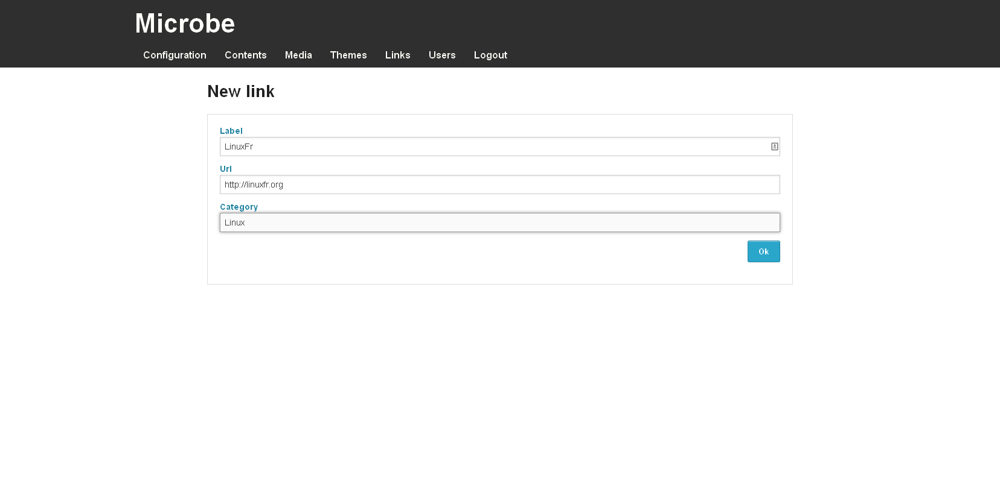

Links management
################

.. note:: You need to be logged in to the Microbe administration part to manage links, for more information see Administration_ part

Links management can be accessed using the link `Links` in the administration navigation bar or following this link : ``www.yourwebsite.com/<sub-url/>admin/links``.

This page lists all the links saved in the application.

You can create and delete links from this interface using the icons placed at the right.

.. Links
.. _Administration : ./admin
