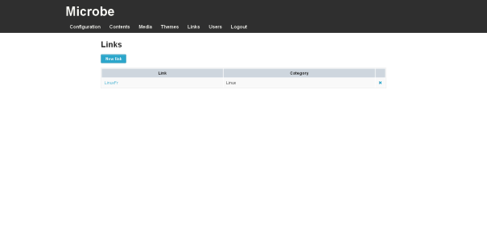

Links management
================

.. note::
   You need to be logged in to the Microbe administration part to manage users, for more information see :doc:`/administrate`.

Links management can be accessed using the link ``Links`` in the administration navigation bar or following this link : ``www.yourwebsite.com/<sub-url/>admin/links``.

.. image:: _static/link_edit.png
   :align: center
   :class: screenshot

This page lists all the links saved in the application.

You can create and delete links from this interface using the icons placed at the right.

                                                                  
