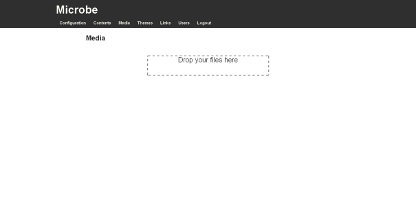
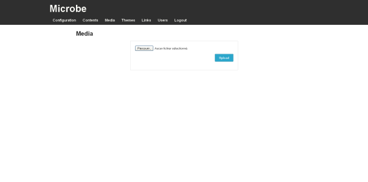

Media management
================

.. note::
   You need to be logged in to the Microbe administration part to manage users, for more information see :doc:`/administrate`.

Media management can be accessed using the link ``Media`` in the administration navigation bar or following this link : ``www.yourwebsite.com/<sub-url/>admin/media``.

To use media in your contents you can upload it directly in your editor if your browser supports HTML5 file API or you can upload it using this page.

           
This page lists all the media uploaded in the application, you can delete it from here.

Upload is managed using the HTML5 file API for the Drag and drop, just drag and drop your files in the area. If your browser doesn't allow it you can use a the regular upload button.

Files uploaded will be reachable at ``http://www.yourwebsite.com/<sub-url/>static/media/<your_file_name>``.
                                                                  
