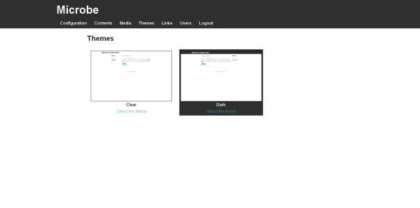

Theming support
===============

.. note::
   You need to be logged in to the Microbe administration part to manage users, for more information see :doc:`/administrate`.

Microbe comes with two themes ``dark`` and ``clear``. You can switch your website theme using the ``Theme`` tab in administration page or following this link : ``www.yourwebsite.com/<sub-rul/>admin/themes``.

You just need to select the theme you want from those displayed

You can get more themes at the address http://github.com/j0ack/microbe-themes/. Download the last archive including the subrepositories and extract it.

To install a new theme paste the theme directory in ``$HOME/.microbe/themes/``.

How to create my own theme
--------------------------

To create your own theme you can customize the default themes or create a new one from scratch.

Microbe comes with a command to easily create your own theme skeleton

.. code-block:: bash
   
   $ microbe theme

Themes are based on `Jinja2`_ template engine using the `Flask-Themes2`_ extension.

Skeleton
^^^^^^^^

The above command allows you to create a theme skeleton like described:

.. code-block:: bash

   mythemedir
   +------- info.json
   +------- static
   |           +------- css
   |           +------- js
   +------- templates
                +------- page.html
                +------- index.html
                +------- archive.html

**info.json**

The ``info.json`` file must contains the themes metadata

.. code-block:: json
   
   {
       "application": "microbe",
       "identifier": "your_theme_id",
       "name": "your_theme_name",
       "author": "Your name",
       "license": "Your license",
       "description": "A description",
       "version": "your_theme_version",
       "preview": "A preview file stored in static dir if available"
   }

**html files**

You can access your static directory thanks to ``theme_static`` function:

.. code-block:: django

   <!doctype>
     <html>
       <head>
         <link rel="stylesheet" src="{{ theme_static('css/style.css') }}">
       </head>
       <body>
       </body>
     </html>

You can extend your theme templates using ``theme`` function:

.. code-block:: django

   

**archive.html**

Archive page listing all the contents.

    **Parameters** :

    - ``pages`` : a list of ``Page`` object
    - ``pagination`` : pagination using foundation templates

**page.html**

Templates used to render your static pages and posts objects.

    **Parameters** :

    - ``page`` : a ``Page`` object

**index.html**

Templates used to render a list of objects (used by ``index``, ``tags`` and ``categories``)

    **Parameters** :
    
    - ``title`` : page title
    - ``pages`` : a list of ``Page`` object
    - ``pagination`` : pagination using foundation templates

Variables
^^^^^^^^^

These are the variables you can use in the different templates :

+------------------------------+--------------------------------------------------------------------------+
| Name                         | Description                                                              |
+==============================+==========================================================================+
| *config.SITENAME*            | Site name registered in config                                           |
+------------------------------+--------------------------------------------------------------------------+
| *config.SUBTITLE*            | Site description registered in config                                    |
+------------------------------+--------------------------------------------------------------------------+
| *config.RSS*                 | ``Y`` if RSS is enabled else ``N``                                       |
+------------------------------+--------------------------------------------------------------------------+
| *g.links*                    | Dict of links registered in Admin page ``{ CATEGORY : [link1, link2] }`` |
+------------------------------+--------------------------------------------------------------------------+
| *g.categories*               | List of posts categories                                                 |
+------------------------------+--------------------------------------------------------------------------+
| *g.search_form*              | Form to search in contents                                               |
+------------------------------+--------------------------------------------------------------------------+
| *Page*                       | Current content object                                                   |
+------------------------------+--------------------------------------------------------------------------+

Please refers to themes example to see how use it.

Feel free to create your own theme and contact me for a pull request.

Once you have created your own theme, select it in the Themes management.

.. _Jinja2: http://jinja2.pocoo.org/
.. _Flask-Themes2: https://pypi.python.org/pypi/Flask-Themes2/
