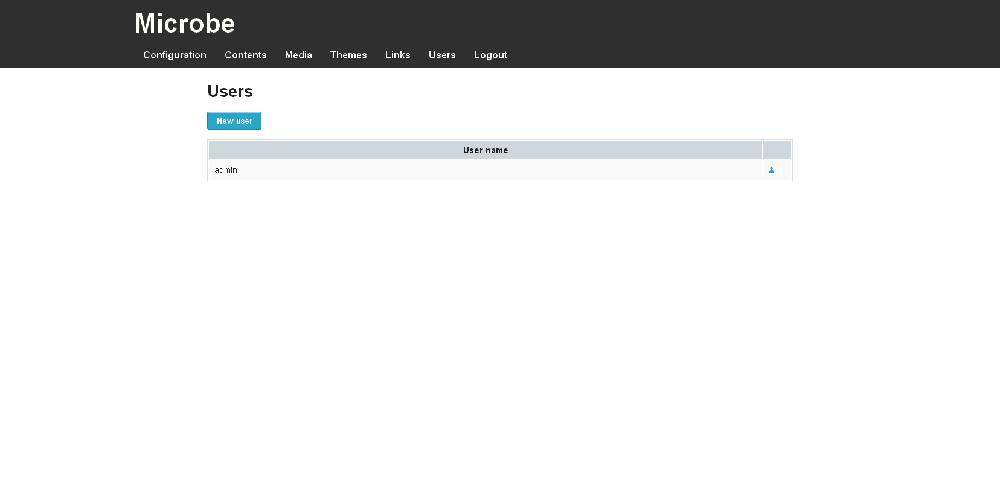

Users management
################

.. note:: You need to be logged in to the Microbe administration part to manage users, for more information see Administration_ part

Users management can be accessed using the link ``Users`` in the administration navigation bar or following this link : ``www.yourwebsite.com/<sub-url/>admin/users``.

This page lists all the user saved in the application.

You can create/delete/edit users from this interface using the icons placed at the right of the user name.

.. note:: Deletion is only permitted if there is at least two users.

To edit a user you just need to enter a new password and confirm it.

.. warning:: If you edit the current user and change his password, you will be disconnected from the administration part and need to login once more.

.. Links
.. _Administration : ./admin
